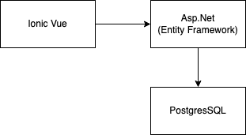

# Stop Foodwaste Challenge Bärnhäckt 2024

___

## Aktueller Stand des Sourcecodes

[Github Link](https://github.com/Poisonlocket/Bernhackt_LEFTOVERLove "link to github repo")

## Ausgangslage

Foodwaste, zu deutsch Lebensmittelverschwendung ist ein Problem, das uns alle betrifft. Foodwaste zu verhindern, ist eines der globalen Sustainability Goals der UN [Details](https://sdgs.un.org/topics/sustainable-consumption-and-production "sustainability goals"). Die Schweiz hat sich dazu verpflichet, dieses Ziel zu erreichen. Doch neuere Zahlen zeigen, dass wir noch immer alle zusammen an diesem Thema arbeiten müssen. 2017 zeigte eine schweizer Studie der ETH [Link](https://www.swissinfo.ch/eng/society/stop-the-rot-_survey-reveals-full-impact-of-swiss-food-waste/45324664 "food waste study 2017"), dass die Hälfte der Lebensmittelverschwendung durch Haushalte verursacht werden. Auch die neusten Zahlen geben keine Entwarnung; der Foodwaste ging kaum zurück und die Lebensmittel, die im Abfall von Haushalten landen, machen immernoch rund 38% aus [Link](https://www.swissinfo.ch/eng/society/stop-the-rot-_survey-reveals-full-impact-of-swiss-food-waste/45324664 "link zahlen 2024"). Somit sind die Haushalte leider führend im Verschwenden von Lebensmitteln. Aber warum? Lebensmittelverschwendung in Haushalten wird durch eine Kombination aus Verhaltensweisen (zB Essensplanung, Protionsgrössen), Wissenslücken (zB Fehlverständnis vom Haltbarkeitsdatum) und wirtschaftlichen Faktoren (zB Promotionen auf Grosspackungen) beeinflusst. Es gibt bereits Foodsharing Angebote wie das Foodsharing-Network [Link](https://foodsharing.network/ "foodsharing network") oder Madame Frigo [Link](https://www.madamefrigo.ch/de/ "Madame Frigo"). Dies ist bereits ein sehr guter Vorstoss und soll auf keinen Fall konkurriert werden. Dennoch bedingen solche Sharingplattformen einiges an Logistik (zB fixe Standorte). Unsere Idee soll solche Angebote ergänzen und jedem Mensch so einfach wie möglich Foodsharing zugänglich machen.

## Zusammenfassung

Am diesjährigen BärnHäckt arbeitet Team **LEFTOVERLove** an der Challenge von Transgourmet ([Challenge](https://www.bernhackt.ch/challenges/2024-stopfoodwaste "challenge description")), um **Transgourmet** beim Bekämpfen von Foodwaste zu helfen. Dies hilf, Lebensmittelverschwendung und die resultierenden Kosten, sowie den negativen Impakt auf die Umwelt, zu verhindern. Wir entwickelten eine Applikation, wo man mit einem klick seine zu rettenden Lebensmittel hochladen kann. Ein/e Retter/in kann mit einem Klick weiderum die Lebensmittel abholen. Die Lösung reiht sich nahtlos an bestehende Anti-Foodwaste Initiativen an, ohne diese zu kanibalisieren. Dabei vereint unsere Lösung ein unkompliziertes und dezetralisiertes Verteilen von Essen, das sonst weggeworfen würde, und bietet sowohl Menschen, die punktuell zu viel Essen zu Hause haben, und Menschen, die Essen retten wollen einen Mehrwert.
### Problembeschrieb TODO ÜBERARBETIEN BITTE

* Marie geht in die Ferien. Sie hat aber noch Früchte zu Hause, die sie nich verwerten kann und wegschmeissen müsste 
* Fridolin hatte eine Geburtstagsparty organisiert, sich aber beim EInkauf überschätzt und kann nicht alle Lebensmittel selbst Essen. Seinen Nachbar mag er nicht, möchte trotzdem nicht, dass das Essen weggeschmissen wird
* Achmed kommt nach einer Blinddarmentzündung vom SPital nah Hause. Er muss sich an die Ernährungsvorgaben seines Artzes halten, möchte aber das Essen bei ihm nicht in den Müll werfen
* Lydia ist vielbeschäftigt und verpasst oft die Öffnungszeiten der Supermarktes. Sie ist Umweltbewusst, und schätzt es,   Essen zu retten, ohne an eine Zeit gebunden zu sein
* Oleg ist Student und hat ein schmales Budget. Er freut sich über die Chance Essen zu retten und dabei seinen Geldbeutel zu schonen.

### Fokus

MVP fokussiert sich auf EINFACHHEIT für die Menschen, die Essen "voorig" haben, und Menschen, welche die Retter/innen des Essens sind.

### Technische Grundsatzentscheide

* Bewusster Entscheid für Mobile
* Personenbezogene Daten werden auf das Minimum reduziert verwendet

## Technischer Aufbau

### Komponenten und Frameworks

- ASPNet Core
- Entity Framework
- Automapper
- VueJS with Ionic

### Aufgabe pro Tool

* C# / ASPNet Core: Backend
* Entity Framework: DB Models
* Automapper: Mapping Models to DTOs
* VueJS: Frontend

## Implementation

TODO: LINK ZUM SCREENCAST

### Out of Scope

* Grading/Gamification der BenutzerInnen
* Chat für die Anbieter und Retter
* Wiki und Tutorial zum Thema Foodwaste und Applikation

### Zukunftsplan

* Gamification
* Machine-Vision zum Erkennen der Produkte auf dem Foto
* Klimaschutzrelevante Daten anzeigen: zB gespartes CO2

## Mitwirkende

- Yasin Gündüz
- Christian Huber
- Matthias Oberholzer
- Lorenzo Bonometti
- Florence Meier

___

:heart: :banana: :computer: :bear: :switzerland: